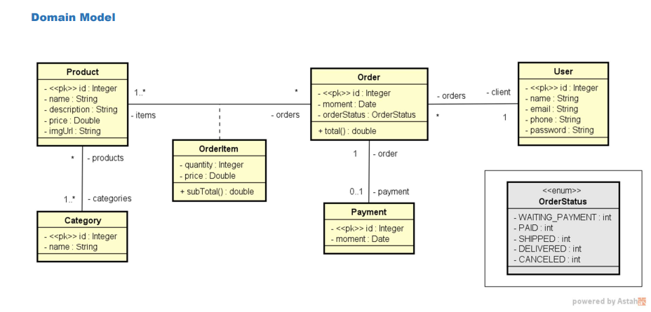

# Spring VSCode Project

## Descrição
Este é um projeto de demonstração para Spring Boot, configurado para usar PostgreSQL como banco de dados. O projeto inclui várias dependências do Spring Boot e outras bibliotecas úteis.

##Modelo de dominio




## Estrutura do Projeto
- `src/main/java/com/teste/spring_vscode/`: Contém a classe principal do aplicativo Spring Boot.
- `src/main/resources/`: Contém arquivos de configuração, como `application-dev.properties`.
- `pom.xml`: Arquivo de configuração do Maven, que gerencia as dependências do projeto.

## Dependências
As principais dependências do projeto incluem:
- `spring-boot-starter-actuator`: Fornece endpoints para monitoramento e gerenciamento do aplicativo.
- `spring-boot-starter`: Inclui componentes essenciais do Spring Boot.
- `spring-boot-devtools`: Ferramentas de desenvolvimento para Spring Boot.
- `h2`: Banco de dados em memória para testes.
- `lombok`: Biblioteca para reduzir o código boilerplate.
- `spring-boot-starter-test`: Ferramentas de teste para Spring Boot.
- `spring-boot-starter-web`: Para construir aplicações web.
- `spring-boot-starter-data-jpa`: Para integração com JPA e bancos de dados relacionais.
- `postgresql`: Driver JDBC para PostgreSQL.

## Configurações
### `application-dev.properties`
- Configurações do banco de dados:
  ```ini
  spring.datasource.url=jdbc:postgresql://localhost:5432/springboot_course
  spring.datasource.username=postgres
  spring.datasource.password=1234567
